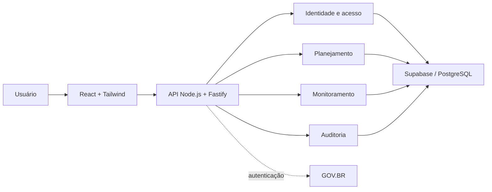

# Arquitetura

## Visão geral

O SUMI é organizado como monólito modular. Interface, API e módulos de negócio pertencem ao mesmo produto e são entregues em uma única imagem de contêiner.

## Limites

### Interface

Responsável por navegação, apresentação e interação. Não contém segredos nem decide autorizações.

### Aplicação

Responsável por regras de negócio, validação, autorização, auditoria, integrações e acesso aos dados.

### Dados

Supabase/PostgreSQL fornece persistência e serviços de dados. Políticas de banco complementam, mas não substituem, as verificações da aplicação.

## Módulos

- `identity`: identidade, vínculos, papéis, permissões e sessões;
- `planning`: tipos, modelos, versões, planos e itens;
- `monitoring`: atualizações, revisões, evidências e consolidação;
- `audit`: eventos de negócio e administrativos;
- `health`: verificação operacional da aplicação.

Os módulos podem compartilhar contratos públicos, mas não acessam detalhes internos uns dos outros diretamente.

## Configuração

Configurações são fornecidas por variáveis de ambiente e validadas durante a inicialização. Variáveis sensíveis não utilizam prefixos destinados ao frontend.

## Implantação

A imagem final contém a API compilada e os arquivos estáticos da interface. O processo Node.js serve ambos na mesma porta.
